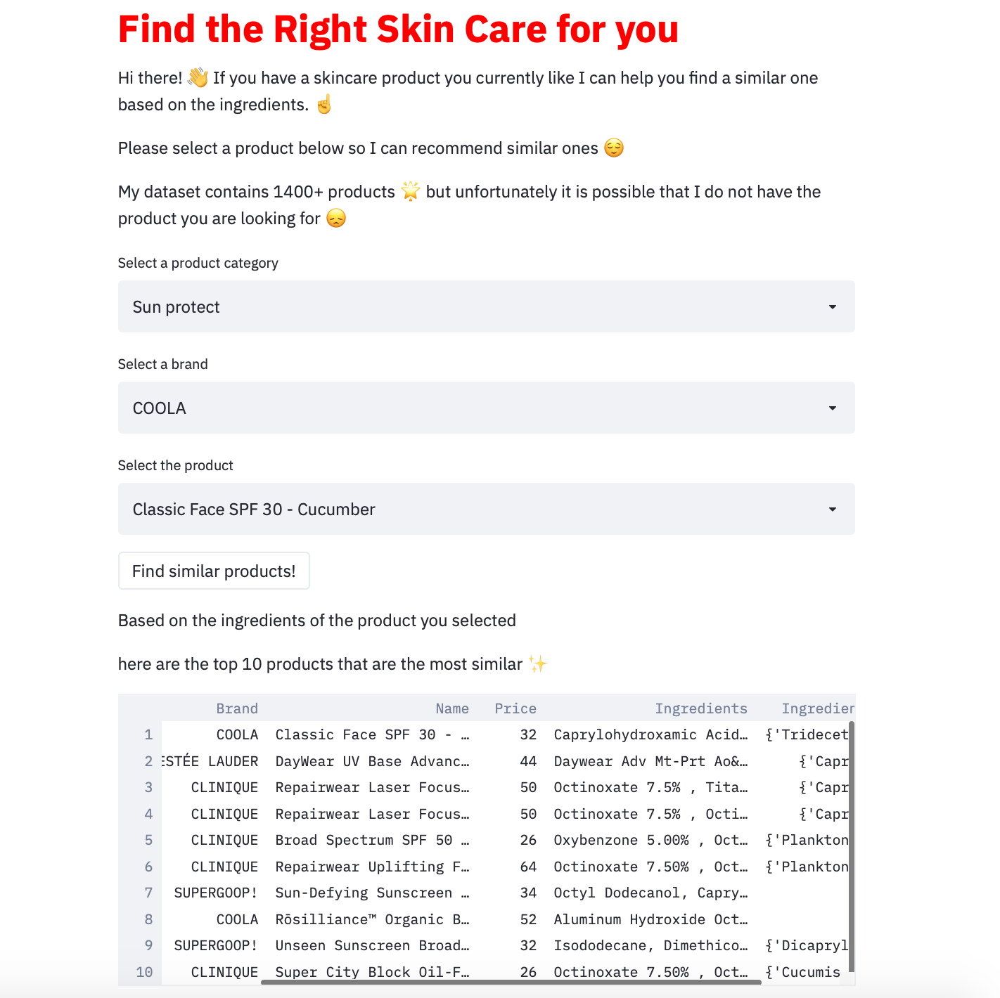

# Recommendation System for Skin Care Products based on Ingredients

For this project I developed a recommendation system for skin care products based on ingredients.

Although some consumers might be attracted to a product based on the brand or marketing techniques I am a firm believer that ingredients are the most important thing to consider when purchasing a skin care product. I am personally very interested in skin care and whenever I wanted to try a new product I would find myself looking at the ingredient list and googling every ingredient I did not recognize. This is of course very time consuming so I decided to create a recommendation system based on ingredients.

In this project, I created a content-based recommendation system where the 'content' is the ingredients of cosmetics. Specifically, I processed ingredient lists for 1472 cosmetics on Sephora via word embedding, then visualized ingredient similarity using a machine learning method called t-SNE.

t-SNE or t-distributed stochastic neighbor embedding is an unsupervised machine learning method to find a low-dimensional representation of the data. This representation, or embedding is then used to find similar products

The data contains more than 1,400 products in 5 different categories:

- Moisturizer
- Cleanser
- Face mask
- Treatment
- Eye cream
- Sun protection

I created an app with with streamlit to make it interactive for the user.
The app looks like this:

## Usage

after you clone the repository, simply run:

> streamlit run comparing-skincare.py
